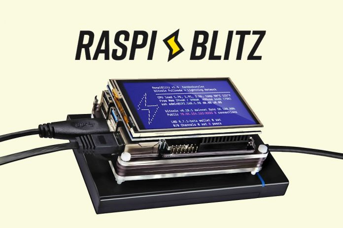

### Construye tu propio nodo Bitcoin.

**Apoya la red de Bitcoin pero sobre todo reclama total soberanía y no dependas de ningún tercero para verificar tus propias transacciones y controlar tu saldo.**
___

Ejemplo: Proyecto **Raspiblitz**
 

 

#### Hardware necesario

Primeramente, es necesario destacar que para tener tu propio nodo Bitcoin no necesitas hardware extra como un RaspberryPi o Arduino o RockPro. Simplemente instalando [*Bitcoin Core*](https://bitcoin.org/en/download) (una aplicación completa del cliente de Bitcoin) en cualquier ordenador de mesa o laptop vieja disponible que no le des uso cuotidiano sería más que suficiente.

Dicho esto, esta guía la escribimos principalmente para los usuarios que se aventuran en el mundo de bitcoin y desean construir su propio nodo utilizando una RaspberryPi. Este tipo de hardware (Barato, Cómodo y Sencillo) nos permiten instalar el cliente y encima de este otras aplicaciones como [*Lightning Network*](https://www.lopp.net/lightning-information.html) y formar así parte de la red de Bitcoin.

*El hardware compartido está probado y aprobado por la comunidad [*Nodo Bitcoin*](https://t.me/NodoBitcoin) pero bajo ningún concepto nos hacemos cargo de eventuales problemas que presenten los dispositivos aconsejados. No tenemos ninguna afiliacion con las companias que venden dichos productos.*

**Por qué hardware recomendados por proyectos separados?**
La razón de esto es que se han dado multiples casos en los que el usuario compró (por ejemplo) el SSD de una marca recomendada por un proyecto y a la vez compró la carcasa del SSD recomendada por otro proyecto y esto llevó a ciertas incompatibilidades. No siempre es el caso, pero es probable, por ende se aconseja comprar hardwares que juntos funcionan correctamente.
___

**Hardware Recomendado por [*Raspiblitz*](https://github.com/rootzoll/raspiblitz):** €217,62

- RaspberryPi 4 4GB (o 8GB) | **4GB = €71.83, 8GB = €92.50** [*Amazon ES link 8GB*](https://www.amazon.es/dp/B07TC2BK1X)
- Fuente de alimentación USB-C, 5.1V, >=3A | **€11.70** [*Amazon ES link*](https://www.amazon.es/dp/B07TZ89BT7)
- 1TB SSD - SanDisk Plus Sata III | **€79.99** [*Amazon ES link*](https://www.amazon.es/dp/B07D998212)
- Carcasa SSD - UGREEN 2.5" Externa USB 3.0 | **€17.99** [*Amazon ES link*](https://www.amazon.es/dp/B06XWSDGP6)
- MicroSD 32GB - Samsung PRO Endurance microSDHC UHS-I U1 | **€13.99** [*Amazon ES link*](https://www.amazon.es/dp/B07CY3QSST)
- Setronics - Caja Negra Armor Case | **€22.12** [*Amazon ES link*](https://www.amazon.es/dp/B07VP6GB4G)

Opcional aconsejado por raspiblitz, pantallas LCD (solo si te decides por este proyecto):
- LCD - 3.5" RPi Display, GPIO connection, XPT2046 Touch Controller
- Quimat 3,5'' Zoll Inch Touch
- ELEGOO Display 3.5" Zoll TFT LCD
- kuman 3.5 Inch Touch Screen TFT Monitor

 

Para montar un nodo con raspiblitz sigue la siguiente guía (en inglés, trabajaré para traducirla): [Raspiblitz_gitub_page](https://github.com/rootzoll/raspiblitz#assemble-your-raspiblitz)

Si deseas apoyar el proyecto y comprar un raspiblitz listo para usar puedes hacerlo aquí: [shop.fulmo.org](https://shop.fulmo.org/product-category/raspiblitz/) 
___

**Hardware Recomendado por [*Umbrel*](https://getumbrel.com/#start):** €217,62

Con respecto al hardware recomendado por Umbrel, al ser links principalmente de Amazon . com me redirige a esa tienda. Algunos de los links que comparto no son especificaménte los recomendados por el equipo pero son los más similares que encontré por marca y características. 

- RaspberryPi 4 4GB (o 8GB) [*Amazon ES link*](https://www.amazon.es/dp/B07TC2BK1X) 
- Fuente de alimentación USB-C, 5.1V, >=3A [*Amazon ES link*](https://www.amazon.es/dp/B07TZ89BT7)
- Crucial MX500 1TB (3D NAND, SATA, 2.5") [*Amazon ES link*](https://www.amazon.es/dp/B077SF8KMG)
- Carcasa SSD - ORICO 2.5" Externa USB 3.0 con UASP para HDD [*Amazon ES link*](https://www.amazon.es/dp/B08B5W9HB6)
- MicroSD 32GB - Samsung PRO Endurance microSDHC UHS-I U1 [*Amazon ES link*](https://www.amazon.es/dp/B07CY3QSST)
- Setronics - Caja Negra Armor Case [*Amazon ES link*](https://www.amazon.es/dp/B07VP6GB4G)

Opcional aconsejado por raspiblitz, pantallas LCD (solo si te decides por este proyecto):
- LCD - 3.5" RPi Display, GPIO connection, XPT2046 Touch Controller
- Quimat 3,5'' Zoll Inch Touch
- ELEGOO Display 3.5" Zoll TFT LCD
- kuman 3.5 Inch Touch Screen TFT Monitor

 

Para montar un nodo con raspiblitz sigue la siguiente guía (en inglés, trabajaré para traducirla): [Raspiblitz_gitub_page](https://github.com/rootzoll/raspiblitz#assemble-your-raspiblitz)

Si deseas apoyar el proyecto y comprar un raspiblitz listo para usar puedes hacerlo aquí: [shop.fulmo.org](https://shop.fulmo.org/product-category/raspiblitz/) 
___