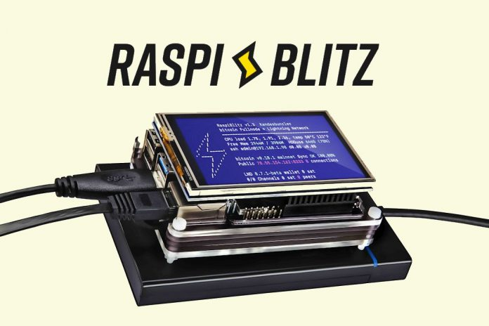

### Raspiblitz
___

 

**Raspiblitz es un HTM (hazlo tú mismo) Nodo de [Lightning](https://www.lopp.net/lightning-information.html) basado en [LND](https://github.com/LightningNetwork/lnd) (lightning network deamon) que funciona conjuntamente con un [Nodo Completo de Bitcoin](https://bitcoin.org/en/full-node) en un RaspberryPi con un SSD o HDD de 1TB y una pantalla táctil para una sencilla implementación y monotorización del nodo.**

Raspiblitz se creó con fin educativo para que el usuario pudiera crear/tener su propio nodo de forma centralizada en casa.
___

**Hardware Recomendado por <a name="raspiblitz">[*Raspiblitz*](https://github.com/rootzoll/raspiblitz):**</a> €217,62

- RaspberryPi 4 4GB (o 8GB) | **4GB = €71.83, 8GB = €92.50** [*Amazon ES link 8GB*](https://www.amazon.es/dp/B07TC2BK1X)
- Fuente de alimentación USB-C, 5.1V, >=3A | **€11.70** [*Amazon ES link*](https://www.amazon.es/dp/B07TZ89BT7)
- 1TB SSD - SanDisk Plus Sata III | **€79.99** [*Amazon ES link*](https://www.amazon.es/dp/B07D998212)
- Carcasa SSD - UGREEN 2.5" Externa USB 3.0 | **€17.99** [*Amazon ES link*](https://www.amazon.es/dp/B06XWSDGP6)
- MicroSD 32GB - Samsung PRO Endurance microSDHC UHS-I U1 | **€13.99** [*Amazon ES link*](https://www.amazon.es/dp/B07CY3QSST)
- Setronics - Caja Negra Armor Case | **€22.12** [*Amazon ES link*](https://www.amazon.es/dp/B07VP6GB4G)

Opcional aconsejado por raspiblitz, pantallas LCD (solo si te decides por este proyecto):
- LCD - 3.5" RPi Display, GPIO connection, XPT2046 Touch Controller
- Quimat 3,5'' Zoll Inch Touch
- ELEGOO Display 3.5" Zoll TFT LCD
- kuman 3.5 Inch Touch Screen TFT Monitor

 

Para montar un nodo con raspiblitz sigue la siguiente guía (en inglés, trabajaré para traducirla): [Raspiblitz](https://github.com/rootzoll/raspiblitz#assemble-your-raspiblitz)

Si deseas apoyar el proyecto y comprar un raspiblitz listo para usar puedes hacerlo aquí: [shop.fulmo.org](https://shop.fulmo.org/product-category/raspiblitz/) 