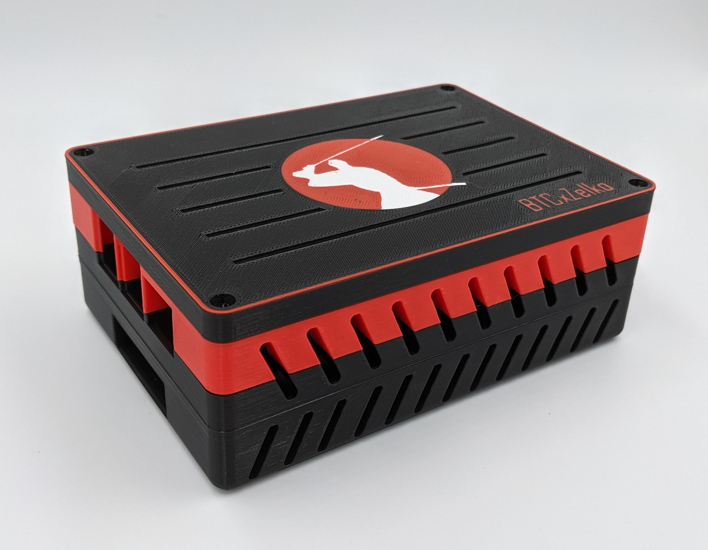

### Samourai (RoninDojo)
___

   

**RoninDojo es un Nodo Completo Bitcoin mantenido por la comunidad de Samourai Wallet y optimizado para funcionar con una RaspberryPi 4. La sencilla interfaz y poderosas herramientas hacen posible que cualquier usuario pueda utilizar y montar los componentes sin importar su nivel técnico. RoninDojo está enfocado en proveer las heramientas que necestias para seguramente utilizar la [billetera de Samourai](https://samouraiwallet.com) conectada con tu Hardware Wallet para ser 'Tu propio Jefe'.**

El proyecto nació gracias al entusiasmo de la comunidad por traer soberanía y privacidad a la mayor cantidad de usuarios posible. Construyendo y manteniendo el software alrededor de los proyectos de Samourai.
___

**Hardware Recomendado por <a name="samourai">[*Samourai*](https://ronindojo.io):**</a> 

Total a gastar: **€324.01** con todos los componentes.

- RaspberryPi 4 4GB (o 8GB) | **4GB = €50.83, 8GB = €69.99** [*Kubii 8GB*](https://www.kubii.es/raspberry-pi-3-2-b/2955-raspberry-pi-4-modelo-b-8gb-0765756931199.html)
    - Los otros 2 resellers donde recomiendan comprar son: [tiendatec](https://www.tiendatec.es/raspberry-pi/gama-raspberry-pi/1231-raspberry-pi-4-modelo-b-8gb-765756931199.html) y [raspipc](https://www.raspipc.es/index.php?ver=tienda&accion=verArticulosFamilia&idFamilia=3)
- Geekworm X825 V2 - Carcasa + Fan | **€26.89** [*Amazon ES link*](https://www.amazon.es/Geekworm-X825-C8-Cooling-Support-Raspberry/dp/B09295FHBW)
- Geekworm X735 Botón de encendido y función de uto Enfriamiento | **€28.89** [*Amazon ES link*](https://www.amazon.es/Geekworm-Raspberry-Management-Shutdown-Expansion/dp/B07NLR49L1)
- GeekPi Sata Storage placa de expansión X825 (solo Pi 4) | **€40.99** [Amazon ES link](https://www.amazon.es/GeeekPi-Raspberry-Storage-Pulgadas-expansión/dp/B086JTH3RP)
- GeekPi DC 5V 4A Fuente Alimentación | **16.99** [Amazon ES link](https://www.amazon.es/GeeekPi-Alimentación-Adaptador-Raspberry-Management/dp/B088M1Q7GF)
- Scandisk 16GB Industrial MicroSD | **€26.27** [Amazon ES link](https://www.amazon.es/SanDisk-Industrial-MicroSDHC-SDSDQAF3-016G-I-Everything/dp/B085GL7GR5)
- Samsung SSD 870 EVO 1TB SATA | **€113.99** [Amazon ES link](https://www.amazon.es/Samsung-Intelligent-Magician-Software-Internal/dp/B08PC5DKZQ) 

 

Para montar un nodo con ronindojo sigue la siguiente guía (en inglés, trabajaré para traducirla): [ronindojo_webpage](https://ronindojo.io)

Si deseas contribuir con el proyecto de alguna forma puedes hacerlo aquí: [code.samourai](https://code.samourai.io/ronindojo) 